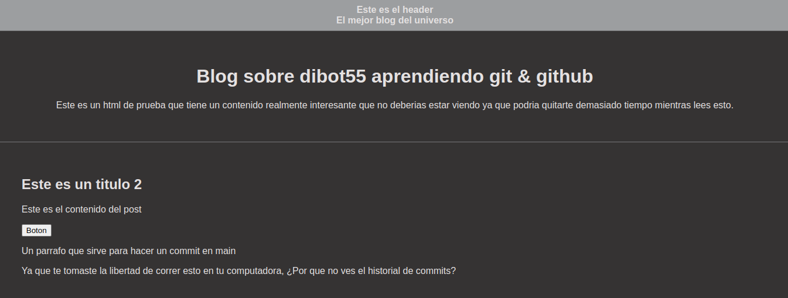

## Curso Profesional de Git & Github

### Descripción
Solo son mis apuntes y un pequeño proyecto donde creé ramas, las fusione, creé conflictos, practique comandos basicos, manupule el stash, generé llaves SSH y tokens de acceso, mezcle una cantidad grande de commits para ver la diferencia entre comandos similares y más.

